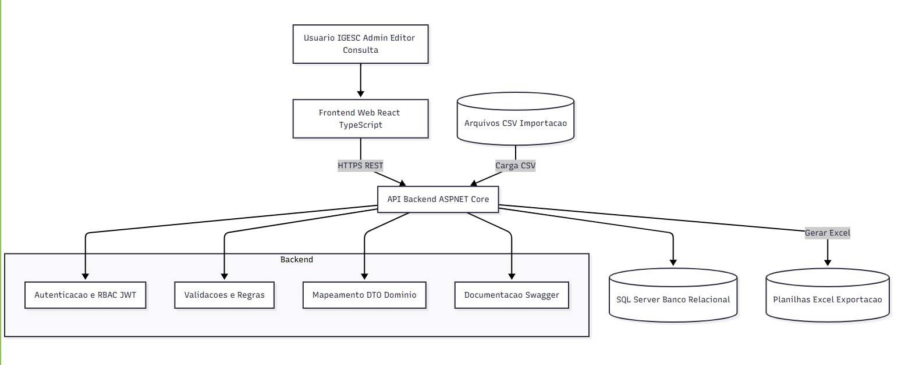
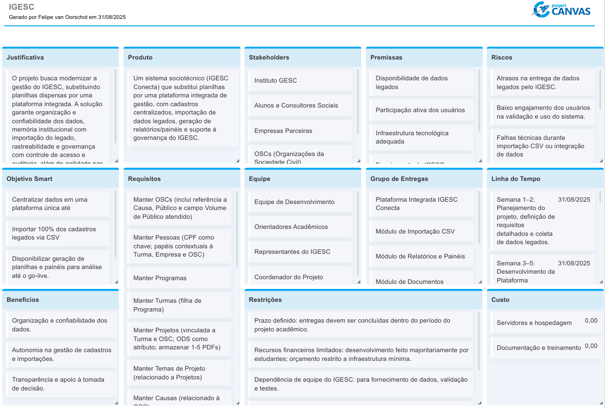
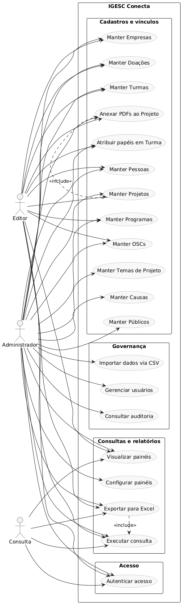
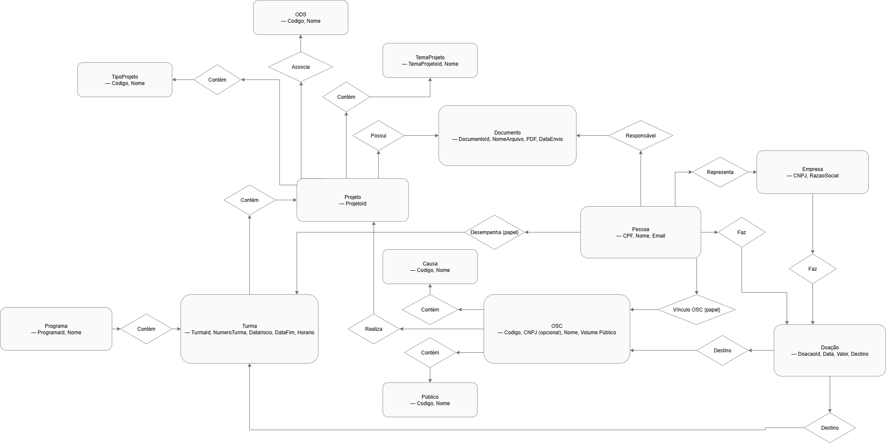
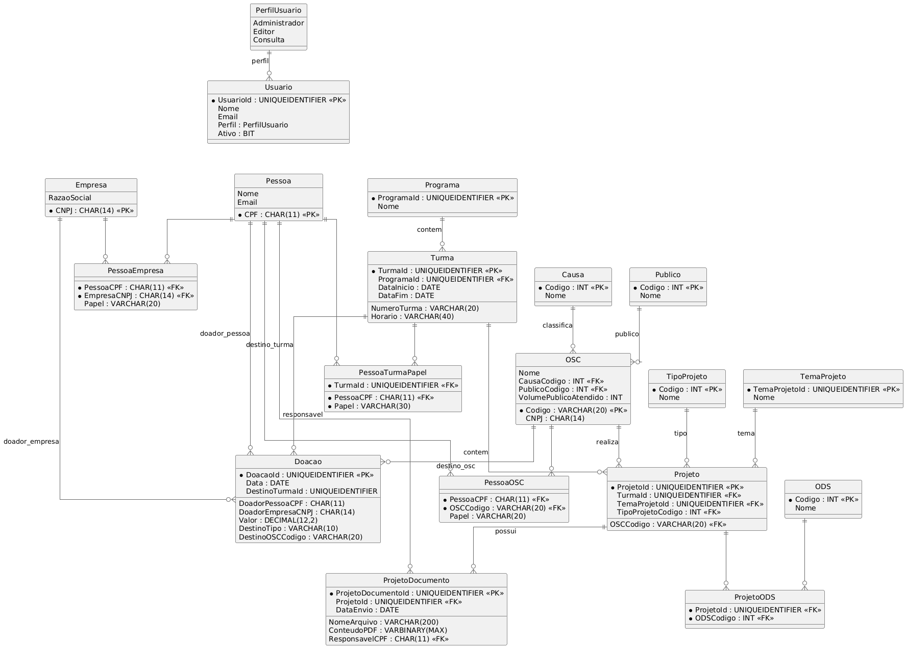

# Especificações do Projeto

Pré-requisitos: <a href="01-Documentação de Contexto.md"> Documentação de Contexto</a>

### Definição do problema e ideia de solução a partir da perspectiva do usuário.

Pessoas do IGESC precisam sair do mosaico de planilhas e trabalhar em uma plataforma única que centralize dados de OSCs, Programas/Turmas, Pessoas (com papéis contextuais), Projetos, Empresas e Doações.
A solução proposta (IGESC Conecta) organiza cadastros, vínculos e documentos PDF dos Projetos, permitindo consultas com exportação para Excel, painéis definidos pelo IGESC e importação via CSV para incorporar o legado, com perfis de acesso e auditoria mínimos. 

## Usuários

| Tipo de Usuário | Descrição | Responsabilidades |
|------------------|-----------|------------------|
| **Administrador (IGESC)** | Governança da aplicação. | Gerenciar usuários e perfis; configurar painéis; manter catálogos (Causas, Públicos, Temas de Projeto); supervisionar auditoria; executar importações CSV; administrar OSCs, Programas/Turmas, Pessoas, Projetos (1–5 PDFs), Empresas e Doações; gerar planilhas Excel. |
| Editor (IGESC) | Operação diária de cadastros e fluxos. | Criar/editar/excluir OSCs, Programas/Turmas, Pessoas (papéis em Turmas; representantes de Empresa/OSC), Projetos (anexar 1–5 PDFs), Empresas e Doações; gerar planilhas Excel; visualizar painéis; não executa importação CSV; não gerencia usuários/perfis. |
| Consulta (IGESC) | Acesso somente leitura. | Consultar dados; visualizar painéis; gerar planilhas Excel; sem criar/editar/excluir; sem importação CSV. |

## Arquitetura e Tecnologias

A solução IGESC Conecta tem três camadas principais: Frontend Web, API Backend e Banco de Dados.
A API expõe REST via HTTPS, com JWT e RBAC por perfil. Faz importação por CSV, exportação em Excel e armazenamento de PDFs no banco.

### Tecnologias

* Frontend: React + TypeScript (SPA, roteamento, fetch), acessibilidade ARIA.

* API/Backend: ASP.NET Core Web API, Entity Framework Core, FluentValidation, AutoMapper, Swagger.

* Segurança: ASP.NET Identity (ou equivalente) + JWT; RBAC por perfil; CORS e TLS.

* Exportação: planilhas Excel (ClosedXML ou EPPlus).

* Importação: CSV (CsvHelper) com validações.

* Banco: SQL Server (modelo relacional; PDFs em VARBINARY MAX).

## Project Model Canvas

> **Links de Acesso**:
> [Link para project model canva](https://app.projectcanvas.online/public-project/1icxTBkG3dglOuUMBWkpHVQFCzyq57u8oAY8bjPpI8=)

## Requisitos

As tabelas que se seguem apresentam os requisitos funcionais e não funcionais que detalham o escopo do projeto. Para determinar a prioridade de requisitos, aplicar uma técnica de priorização de requisitos e detalhar como a técnica foi aplicada.

Técnica de priorização aplicada: MoSCoW, mapeada para ALTA (MUST), MÉDIA (SHOULD) e BAIXA (COULD), considerando valor para o IGESC, dependências técnicas e obrigações de segurança/compliance.

### Requisitos Funcionais

|ID    | Descrição do Requisito  | Prioridade |
|------|-----------------------------------------|----|
|RF-001| Manter OSCs (inclui referência a Causa, Público e campo Volume de Público atendido) | ALTA | 
|RF-002| Manter Pessoas (CPF como chave; papéis contextuais à Turma, Empresa e OSC) | ALTA |
|RF-003| Manter Programas | ALTA |
|RF-004| Manter Turmas (filha de Programa) | ALTA |
|RF-005| Manter Projetos (vinculada a Turma e OSC; ODS como atributo; armazenar 1-5 PDFs) | ALTA |
|RF-006| Manter Temas de Projeto (relacionado a Projetos) | ALTA |
|RF-007| Manter Causas (relacionado à OSC) | ALTA |
|RF-008| Manter Públicos (relacionado à OSC) | ALTA |
|RF-009| Manter Empresas | ALTA |
|RF-010| Manter Usuários (perfis: Administrador, Editor, Consulta) | ALTA |
|RF-011| Manter Doações (doador = Pessoa ou Empresa; data, valor; destino = Turma/OSC/nenhum) | MÉDIA |
|RF-012| Anexar documentos PDFs (1-5) dentro de Projeto, com download/abertura em aba do navegador | MÉDIA |
|RF-013| Geração de planilhas Excel a partir de consultas (modelo a definir na especificação técnica) | MÉDIA |
|RF-014| Importar dados via CSV (modelo a definir na especificação técnica) | MÉDIA |
|RF-015| Controle de acesso por perfil (somente usuários do IGESC operam o sistema) | ALTA |
|RF-016| Auditoria mínima (registrar quem criou/alterou) | BAIXA |
|RF-017| Painel de Dashboards definidos pelo IGESC | MÉDIA |

### Requisitos não Funcionais

|ID     | Descrição do Requisito  |Prioridade |
|-------|-------------------------|----|
|RNF-001| Frontend web responsivo e utilizável em resoluções >= 1366x768 (suporte básico em mobile) | MÉDIA | 
|RNF-002| Desempenho de leitura: respostas em até ~2s para consultas típicas; exportação Excel sem travar a interface | MÉDIA |
|RNF-003| Segurança: autenticação JWT e autorização por perfil (RBAC) em todas as rotas protegidas | ALTA |
|RNF-004| LGPD: proteção de dados pessoais, mínimo necessário, perfis de acesso, registro de operações | ALTA |
|RNF-005| Compatibilidade: navegadores Chrome/Edge versões suportadas pelo LTS | MÉDIA |
|RNF-006| Documentação da API via Swagger/OpenAPI | BAIXA |
|RNF-007| Integridade de arquivo: aceitar apenas PDFs nos anexos de Projeto; validar tipo MIME e tamanho (limite a definir) | ALTA |
|RNF-008| Persistência dos PDFs no banco (VARBINARY) com checagem de integridade (hash) | MÉDIA |
|RNF-009| Logs de aplicação no backend com correlação de requisições | MÉDIA |
|RNF-010| Migrações de banco versionadas (EF Core Migrations) | MÉDIA |
|RNF-011| Tratamento de erros padronizado na API (códigos/contratos de erro) | MÉDIA |
|RNF-012| CORS e TLS habilitados no acesso ao backend | ALTA |

## Restrições

O projeto está restrito pelos itens apresentados na tabela a seguir.

|ID| Restrição                                             |
|--|-------------------------------------------------------|
|01| Apenas usuários do IGESC operam o sistema (Admin, Editor, Consulta) |
|02| Importação exclusivamente via arquivos CSV (sem XLSX) |
|03| Relatórios exclusivamente como planilhas Excel (sem PDFs/BI externos nesta fase) |
|04| ODS é lista fixa, sem CRUD; usada apenas como atributo de Projeto |
|05| Projetos sempre vinculados a Turma + OSC |
|06| Em Projeto, somente PDFs (1-5) são aceitos e armazenados no banco |
|07| Programa é um agrupamento de Turmas (Turma pertence a um único Programa) |
|08| Pessoa identificada unicamente por CPF |
|09| Empresa identificada unicamente por CNPJ |
|10| OSC possui CNPJ opcional; chave operacional por código interno mantendo CNPJ ou nome único |
|11| Papéis em Turma: a mesma pessoa pode ter múltiplos papéis na mesma Turma |
|12| Participante em Turma exige vínculo da Pessoa a uma OSC (indicar qual) |
|13| Representante de Empresa é vínculo Pessoa-Empresa; Representante da Organização é vínculo Pessoa-OSC |
|14| Tecnologias definidas: Frontend React+TypeScript, Backend ASP.NET Core (.NET 8), SQL Server |
|15| Campos detalhados de cada entidade serão definidos posteriormente pelo IGESC |

## Diagrama de Caso de Uso

O diagrama de casos de uso é o próximo passo após a elicitação de requisitos, que utiliza um modelo gráfico e uma tabela com as descrições sucintas dos casos de uso e dos atores. Ele contempla a fronteira do sistema e o detalhamento dos requisitos funcionais com a indicação dos atores, casos de uso e seus relacionamentos. 

## Modelo ER

O Modelo ER (Entidade-Relacionamento) utiliza um diagrama para ilustrar de forma clara como as entidades, que representam objetos ou conceitos relevantes, se interrelacionam dentro da aplicação interativa. Este modelo facilita a visualização das conexões e interações entre os diferentes componentes do sistema, proporcionando uma compreensão abrangente da estrutura de dados subjacente.

## Projeto da Base de Dados

O projeto da base de dados corresponde à representação das entidades e relacionamentos identificadas no Modelo ER, no formato de tabelas, com colunas e chaves primárias/estrangeiras necessárias para representar corretamente as restrições de integridade.

 

